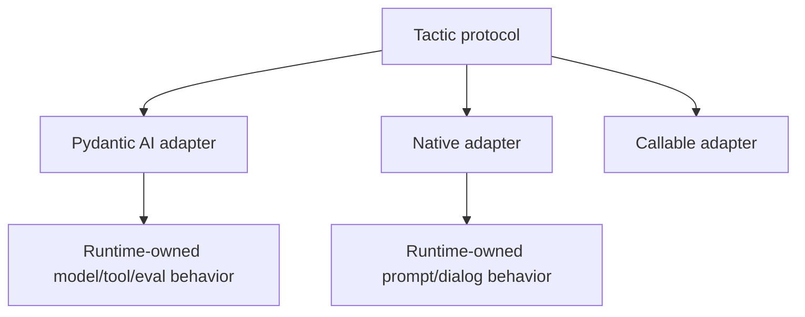

# Runtime Boundary

LLLM owns the tactic boundary, not the agent runtime.

Runtime-owned features stay runtime-owned:

- model and provider settings,
- tools and tool approval,
- tracing and Logfire/OpenTelemetry instrumentation,
- eval hooks,
- graph or workflow state,
- durable execution IDs.

LLLM forwards context where a runtime supports it, exposes tactic metadata, and
keeps the service/package boundary stable.

