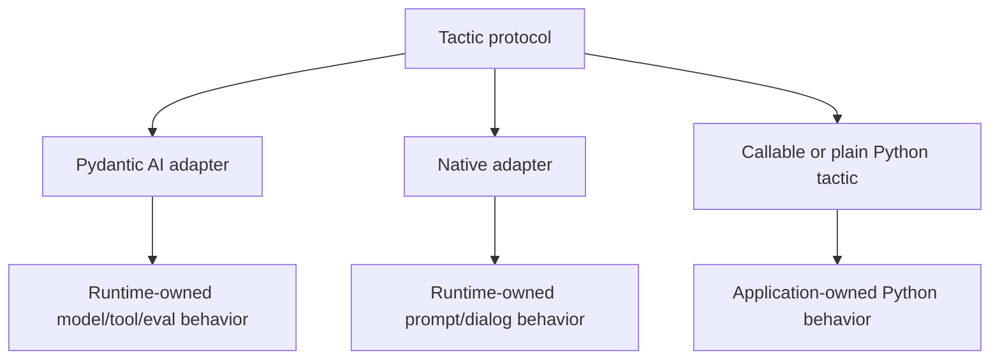

# Runtime Boundary

LLLM owns the tactic boundary, not the agent runtime.

Runtime-owned features stay runtime-owned:

- model and provider settings,
- tools and tool approval,
- tracing and Logfire/OpenTelemetry instrumentation,
- eval hooks,
- graph or workflow state,
- durable execution IDs,
- runtime-specific streaming semantics.

LLLM forwards context where a runtime supports it, exposes tactic metadata, and
keeps the service/package boundary stable.



## Why The Boundary Is Small

A tactic needs enough structure to be reusable:

- JSON-schema-compatible input and output,
- one stable call shape,
- optional stream and event shapes,
- portable metadata,
- service and package refs.

It does not need to standardize every model runtime. If Pydantic AI adds new
provider options or tool approval behavior, those remain Pydantic AI concerns.
If a native workflow tracks prompt lineage or forked dialogs, that remains
native runtime state.

## Context Forwarding

`CallContext` is the bridge from LLLM callers into runtime-owned execution:

```python
from lllm import CallContext

context = CallContext(
    request_id="req-1",
    trace_id="trace-1",
    metadata={"caller": "worker"},
)
```

Adapters may forward metadata into runtime calls when the runtime exposes a
compatible place for it. If the runtime does not, the tactic boundary still
keeps the context available for logs, proxies, services, and package metadata.

## Adapter Rule

Adapters should convert runtime-specific objects into tactic inputs, outputs,
events, and metadata at the edge. They should not leak runtime internals into
the public service or package contract.
