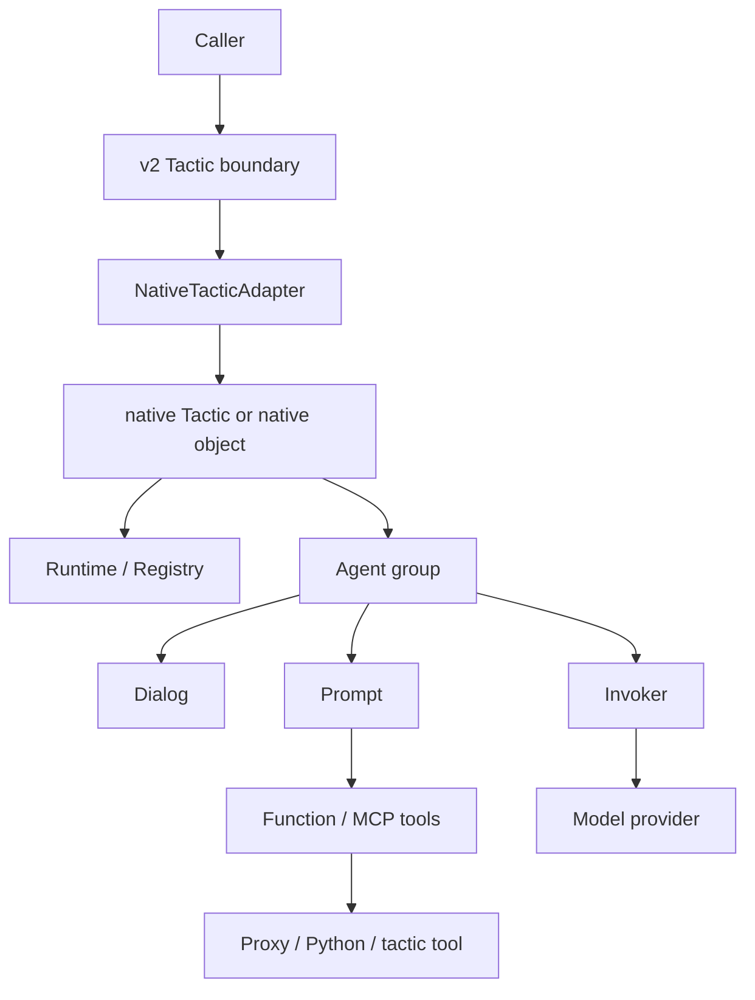
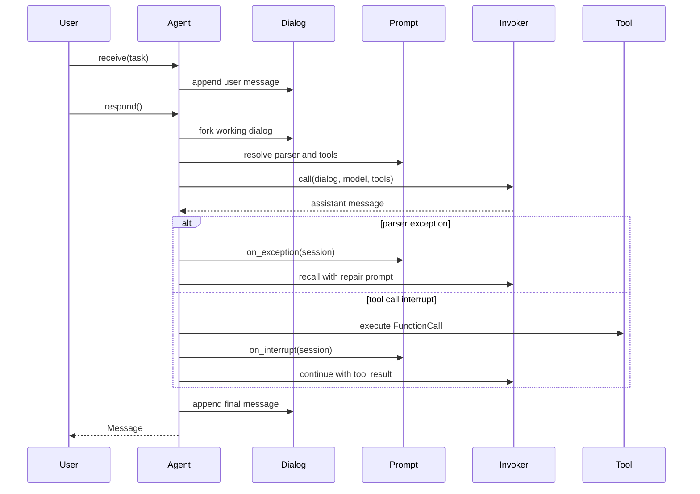

# Native Runtime

The native runtime is the preserved LLLM v1 agent system inside v2. Use it
when the prompt, dialog, parser, tool call, or agent-session trace is part of
the artifact you want to study or reuse.

The v2 protocol boundary still stays small: services and packages expose
typed tactics. Native keeps the transparent machinery behind that boundary.

```python
from lllm.runtimes.native import Dialog, Prompt, Role

system = Prompt(path="agent/system", prompt="You are a {style} assistant.")

dialog = Dialog(owner="planner")
dialog.put_prompt(system, prompt_args={"style": "careful"}, role=Role.SYSTEM)
dialog.put_text("Draft the next checkpoint.", name="operator")

retry = dialog.fork(last_n=1, first_k=1)
```

## What Was Restored

The native runtime is no longer a thin prompt/dialog primitive file. It now
contains the old package shape again:

```text
lllm.runtimes.native
  core/        Agent, Dialog, Prompt, Runtime, Tactic, resources
  native/      NativeTactic and agent-backed tactic helpers
  invokers/    provider invocation boundary, including LiteLLM
  proxies/     API proxy tools and tactic-backed proxy endpoints
  sandbox/     optional Jupyter execution support
  tools/       optional computer-use helpers
```

Importing `lllm` does not import the provider integrations. LiteLLM, Jupyter,
OpenAI computer-use helpers, and proxy-specific packages remain optional.

## Architecture



Native owns the inside of the turn: prompt rendering, dialog lineage, parser
retries, tool-call interrupts, invoker traces, and agent sessions. The v2
adapter owns the outside: typed input/output, service metadata, package refs,
and reusable tactic information.

## Agent Call Flow



This is the part that the thin v2 primitive did not carry. Native `Agent`
keeps the full loop and records an `AgentCallSession` with exception retries,
interrupts, LLM recalls, invoke traces, delivery state, and cost.

## Prompts And Tools

`Prompt` is a behavior definition for a single turn. It can carry a template,
parser, structured output format, local tools, MCP tool declarations, handler
prompts, and provider-specific `addon_args`.

```python
from lllm.runtimes.native import FunctionCall, Prompt, tool

@tool(description="Add two values")
def add(left: int, right: int = 1) -> int:
    return left + right

prompt = Prompt(
    path="math/solve",
    prompt="Solve {question}.",
    function_list=[add],
)

call = add(FunctionCall(name="add", arguments={"left": 2, "right": 3}))
assert call.result == 5
```

Native tool schemas are copied at the boundary. Changing the dictionary
returned by `to_tool()` or `prompt.functions` does not mutate the original
prompt.

## Dialog Lineage

`Dialog` is append-only. It can fork branches while retaining explicit lineage
metadata:

```python
child = dialog.fork(last_n=1, first_k=1)

assert child.parent is dialog
assert child.tree_node.parent_id == dialog.dialog_id
assert dialog.tree_node.children_ids == [child.dialog_id]
```

This is useful for retries, branch comparison, debugging, dataset generation,
and teaching the agent loop from the inside.

## Native Tactics

Subclass `NativeTactic` when a tactic should build live native agents from
config.

```python
from lllm.runtimes.native import NativeTactic


class BriefTactic(NativeTactic):
    name = "brief"
    input_type = str
    output_type = str
    agent_group = ["writer"]

    def call(self, task: str) -> str:
        writer = self.agents["writer"]
        writer.open("draft", prompt_args={"topic": task})
        writer.receive(task)
        return writer.respond().content
```

The config supplies the invoker and agent prompt/model settings:

```python
config = {
    "invoker": "litellm",
    "agent_configs": [
        {
            "name": "writer",
            "model_name": "gpt-4o-mini",
            "system_prompt": "You write concise briefs about {topic}.",
        }
    ],
}

tactic = BriefTactic(config=config)
```

Install provider support only when you need live model calls:

```bash
python -m pip install -e ".[native]"
```

## Crossing Into V2

Use `NativeTacticAdapter` when a native object should be exposed as a v2
protocol tactic:

```python
from lllm.runtimes.native import NativeTacticAdapter

public_tactic = NativeTacticAdapter(
    native_tactic,
    package_ref="psi://demo/native/tactics/brief",
)
```

The service layer sees the v2 `TacticInfo`. Native prompts, dialogs, sessions,
and invokers stay behind the adapter.

## Tactics As Native Tools

Native can also consume a v2 protocol tactic as a prompt tool:

```python
from lllm.runtimes.native import Prompt, tactic_as_function

lookup = tactic_as_function(search_tactic, parameter_mode="kwargs")
prompt = Prompt(
    path="research/answer",
    prompt="Use tools when needed.",
    function_list=[lookup],
)
```

This mirrors the Pydantic AI adapter's callable-tool bridge without making
native depend on Pydantic AI. It is just a protocol tactic wrapped as a native
`Function`.

## Optional Integrations

Native integrations are grouped by extras:

```bash
python -m pip install -e ".[native]"   # LiteLLM invoker and common native deps
python -m pip install -e ".[sandbox]"  # Jupyter sandbox support
python -m pip install -e ".[tools]"    # OpenAI/tqdm/playwright tool helpers
```

Builtin proxies are restored under `lllm.runtimes.native.proxies`. They should
be tested without live network calls unless credentials and provider access are
explicitly available.
