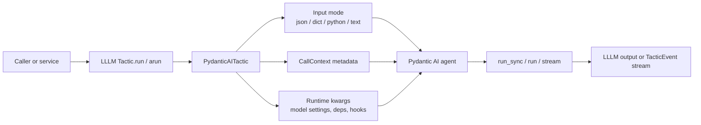

# Pydantic AI

Pydantic AI is the first-class agentic runtime target for LLLM.

Configure the agent normally, then wrap it as a tactic:

```python
from lllm.runtimes import PydanticAITactic

tactic = PydanticAITactic(
    agent,
    input_type=BriefInput,
    output_type=BriefOutput,
)
```

LLLM does not replace Pydantic AI. Pydantic AI still owns model execution,
tools, deps, model settings, streaming, tracing, eval hooks, graphs, and
durable workflow behavior. LLLM adds a reusable tactic boundary around the
agent.

## Agent Call Flow

The old “agent call” idea is still present in v2 as the Pydantic AI tactic call
path. LLLM normalizes the tactic request, forwards runtime-owned kwargs and
context metadata when appropriate, then lets the agent perform the actual run.



The boundary is intentionally one-way: LLLM prepares the call and validates the
returned value, while Pydantic AI keeps owning tools, model/provider behavior,
streaming internals, tracing, and durable runtime state.

## What The Adapter Forwards

The adapter preserves runtime ownership while forwarding the pieces that belong
at a call boundary:

- input normalization into the declared tactic input type,
- output validation through the declared output type,
- `CallContext` metadata when the agent run method accepts metadata,
- runtime-specific kwargs such as model settings or deps,
- output schemas when the agent exposes them,
- streaming modes where the runtime provides streamed output.

Executable offline examples:

- `examples/pydantic_ai_tactic/structured_agent.py`
- `examples/pydantic_ai_tactic/surrounding_features.py`

The first example covers structured input/output and streaming. The second
shows surrounding runtime-owned features passing through the wrapper without
turning into LLLM concepts.

## Package Shape

A package can expose a Pydantic AI-backed tactic the same way it exposes any
other tactic:

```toml
[tactics.brief]
entry = "demo.agent:build_tactic"
input = "brief_input"
output = "brief_output"
runtime = "pydantic-ai"
```

The entrypoint can return a ready `PydanticAITactic` or a factory that builds
one. Package cards should describe the tactic behavior, expected config, and
safe example inputs rather than provider secrets.

## Live Provider Smoke Tests

Live provider credentials can be smoke-checked without sending prompts:

```bash
if [ -f .env ]; then
  set -a
  source .env
  set +a
fi
LLLM_LIVE_PROVIDER_TESTS=1 pytest tests/test_live_providers.py
```

Those opt-in tests list models using whichever credentials are available:
`OPENAI_API_KEY`, `ANTHROPIC_API_KEY`, and `TOGETHER_API_KEY`. Together is
included as an expected-soft-failure check because some networks return an
edge-level `403 error code: 1010` before API-key validation.

## Native Tactics As Tools

Native LLLM tactics can be exposed as ordinary Python callables. Register those
callables with Pydantic AI the same way you register any other tool:

```python
tool = my_tactic.as_tool(parameter_mode="kwargs")
```

This bridge does not replace Pydantic AI's tool system. It only gives Pydantic
AI a typed callable boundary for logic written behind the LLLM tactic
protocol.
