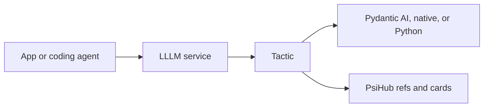

# LLLM

[lllm.one](https://lllm.one){ .psi-domain }

LLLM is the protocol and service layer for reusable agentic tactics. It keeps
the public contract small: wrap focused logic, expose it as a service, describe
it for packages, and let the runtime underneath remain runtime-owned.

<div class="psi-tiles">
  <div class="psi-tile">
    <strong>Tactic</strong>
    Typed unit of work with local, async, stream, and service-ready call paths.
  </div>
  <div class="psi-tile">
    <strong>Runtime</strong>
    Pydantic AI, native LLLM, plain Python, or another adapter owns execution.
  </div>
  <div class="psi-tile">
    <strong>Service</strong>
    FastAPI exposes tactics through predictable envelopes and error shapes.
  </div>
  <div class="psi-tile">
    <strong>Package</strong>
    PsiHub metadata makes tactics discoverable, configurable, and composable.
  </div>
</div>

## Fast Path

```python
from pydantic import BaseModel
from lllm import Tactic


class EchoInput(BaseModel):
    text: str


class EchoOutput(BaseModel):
    text: str


class EchoTactic(Tactic[EchoInput, EchoOutput]):
    name = "echo"
    input_type = EchoInput
    output_type = EchoOutput

    def _run(self, input_value, *, context=None):
        return EchoOutput(text=input_value.text.upper())


assert EchoTactic().run({"text": "hello"}).text == "HELLO"
```

## Shape

<div class="psi-flow">
  <div>Caller</div>
  <div>FastAPI service</div>
  <div>Tactic</div>
  <div>Runtime adapter</div>
  <div>PsiHub metadata</div>
</div>



## Next

- Start with [Getting Started](getting-started.md).
- Learn the center model in [Tactics](concepts/tactics.md).
- Follow the first tutorial in [First Tactic](tutorials/first-tactic.md).
