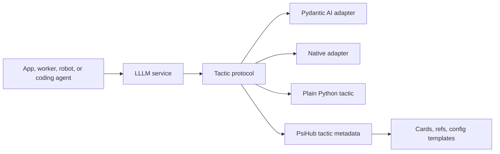

# LLLM

<p class="psi-brand">
  
  
</p>

[lllm.one](https://lllm.one){ .psi-domain }

LLLM is the protocol and service layer for reusable agentic tactics. The center
model is deliberately small: a `Tactic` is a typed unit of work that can run in
process, stream results, sit behind a FastAPI service, and be described as a
PsiHub package resource.

LLLM is not a model runtime. Pydantic AI, native LLLM objects, plain Python,
and future adapters keep owning execution details such as tools, provider
settings, tracing, eval hooks, and workflow state. LLLM gives those runtimes a
stable boundary that other services, workers, coding agents, and package tools
can understand.

<div class="psi-tiles">
  <div class="psi-tile">
    <strong>Tactic</strong>
    Typed work boundary with local, async, streaming, and service-ready call paths.
  </div>
  <div class="psi-tile">
    <strong>Runtime</strong>
    Pydantic AI, native LLLM, plain Python, or another adapter owns execution.
  </div>
  <div class="psi-tile">
    <strong>Service</strong>
    FastAPI exposes `/run`, `/stream`, and `/info` with stable envelopes.
  </div>
  <div class="psi-tile">
    <strong>Package</strong>
    PsiHub metadata makes tactics discoverable, configurable, and composable.
  </div>
</div>

## Fast Path

```python
from pydantic import BaseModel
from lllm import Tactic


class EchoInput(BaseModel):
    text: str


class EchoOutput(BaseModel):
    text: str


class EchoTactic(Tactic[EchoInput, EchoOutput]):
    name = "echo"
    input_type = EchoInput
    output_type = EchoOutput

    def _run(self, input_value, *, context=None):
        return EchoOutput(text=input_value.text.upper())


assert EchoTactic().run({"text": "hello"}).text == "HELLO"
```

Expose the same boundary through FastAPI:

```python
from lllm.services import create_tactic_app

app = create_tactic_app(EchoTactic())
```

```bash
uvicorn app:app --reload
curl -X POST http://127.0.0.1:8000/run \
  -H 'content-type: application/json' \
  -d '{"input":{"text":"hello"}}'
```

## Shape



The important part is that every edge meets the same tactic contract. A caller
does not need to know whether the underlying implementation is a fake offline
test agent, a Pydantic AI agent with tools, a native prompt/dialog workflow, or
a remote HTTP service.

## What LLLM Owns

- `Tactic`, `TacticInfo`, `CallContext`, and `TacticEvent`.
- Local, async, streaming, proxy, and sandbox wrappers at the tactic boundary.
- FastAPI service adapters and remote tactic clients.
- Metadata helpers that export tactics to PsiHub package resources.
- Ref resolution for local or remote tactic bindings.

## What Stays Outside

- Model/provider execution, tools, evals, tracing, and durable workflow state.
- Package storage, validation, cards, agent cards, and config templates.
- Semantic channels, event logs, artifacts, snapshots, and local stores.
- Service launch decisions and operational orchestration.

That split is the point: LLLM makes agentic work reusable without forcing every
runtime and every package to become the same framework.

## Next

- Start with [Getting Started](getting-started.md).
- Learn the tactic contract in [Tactic](protocol/index.md).
- Choose an adapter in [Runtime](runtime/index.md).
- Follow the first tutorial in [First Tactic](tutorials/first-tactic.md).
