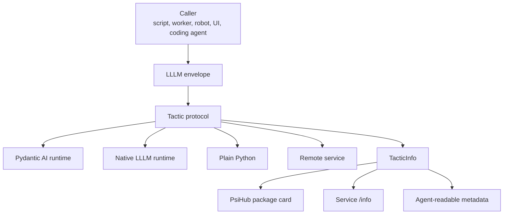
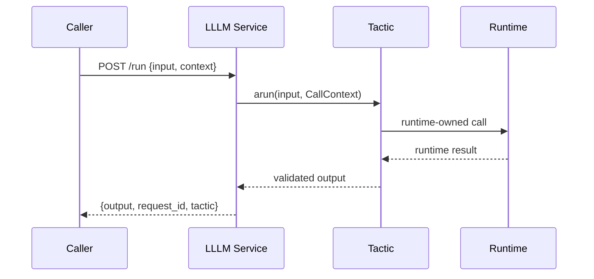

# Tactic

LLLM's tactic protocol is the small public contract that lets agentic work move
between Python objects, services, packages, and coding-agent workflows without
dragging one runtime's internals everywhere.

The protocol is not a model runtime. It is the boundary around work.

<div class="psi-tiles">
  <div class="psi-tile">
    <strong>Tactic</strong>
    The typed unit of work. It validates input, validates output, and exposes
    metadata.
  </div>
  <div class="psi-tile">
    <strong>Context</strong>
    Request, trace, caller, and metadata fields that travel with a call.
  </div>
  <div class="psi-tile">
    <strong>Service</strong>
    A portable FastAPI surface with run, stream, info, and health routes.
  </div>
  <div class="psi-tile">
    <strong>Ref</strong>
    A durable `psi://` identity that can resolve to a local object or remote
    service.
  </div>
</div>

## Layer Map



The caller should not need to know whether a tactic is powered by a Pydantic AI
agent, a native prompt/dialog workflow, a deterministic Python function, or an
HTTP service. It sends one shape and receives one shape.

## Core Objects

| Object | Role |
| --- | --- |
| `Tactic` | Runtime-agnostic work boundary. |
| `CallContext` | Request id, trace id, caller, and metadata. |
| `TacticInfo` | Name, schemas, refs, capabilities, examples, and metadata. |
| `TacticEvent` | Stream/status/error event envelope. |
| `TacticResolver` | Local or remote ref resolution. |
| `RemoteTactic` | HTTP client that still behaves like a tactic. |

The old v1 docs used `Program` for the smallest compute boundary and
`ServiceSpec` for the deployable surface. In the current protocol, the center
object is `Tactic`; services expose one or more tactics, and package metadata
lives in PsiHub.

## Call Shape

New integrations should use the protocol envelope:

```json
{
  "input": {"text": "hello"},
  "context": {
    "request_id": "req-1",
    "trace_id": "trace-1",
    "metadata": {"caller": "demo"}
  }
}
```

Service adapters also accept raw JSON for existing clients, but the envelope is
the shape that leaves room for tracing, audit metadata, and future routing.



## What The Protocol Guarantees

- Input and output can be described as JSON schemas.
- Local calls and HTTP calls share the same envelope.
- Streaming can be represented as output chunks or `TacticEvent` envelopes.
- Public metadata is filtered before it crosses service/package boundaries.
- Refs identify resources without deciding how they are launched.

## What The Protocol Does Not Own

- Provider selection, model settings, tools, eval hooks, and tracing internals.
- Native prompt lineage, dialog forks, parser retries, and invoker sessions.
- Package storage, cards, downloads, and local config generation.
- SSSN channels, event logs, artifacts, snapshots, and stores.
- Process launch, hosting, scheduling, or orchestration policy.

That split keeps LLLM narrow enough to be reusable and explicit enough to be
useful.

## Next

- [Tactic Boundary](tactic-boundary.md) explains the center call contract.
- [Service Boundary](service-boundary.md) shows the HTTP surface.
- [Package Contract](package-contract.md) maps tactics into `psi.toml`.
- [Refs And Resolution](refs-resolution.md) covers local and remote binding.
