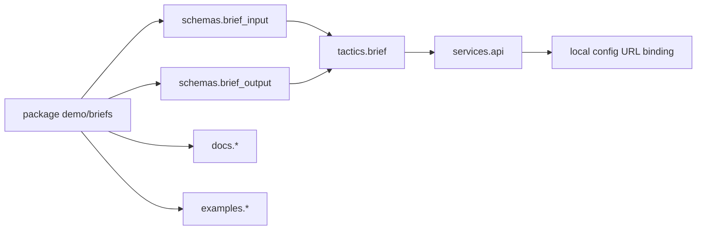

# Package Contract

`psi.toml` is the package contract. PsiHub owns the package format,
validation, cards, downloads, and local config templates. LLLM contributes
tactic and service metadata that can be indexed there.

The old v1 docs described packages as the place where programs, services,
workers, channels, and launch profiles meet. That idea remains, but v2 keeps
the ownership sharper:

- LLLM owns tactics and tactic services.
- SSSN owns semantic channels, artifacts, snapshots, and stores.
- PsiHub owns package metadata, refs, cards, and local config.
- Launch tools read the package; the package itself is not a launcher.

## Minimal LLLM Package

```toml
[package]
psi_version = "0.1"
org = "demo"
name = "briefs"
version = "0.1.0"
kind = "tactic"
primary = "tactics.brief"
description = "Reusable briefing tactic."

[schemas.brief_input]
entry = "demo.schemas:BriefInput"

[schemas.brief_output]
entry = "demo.schemas:BriefOutput"

[tactics.brief]
entry = "demo.tactics:build_tactic"
input = "brief_input"
output = "brief_output"
runtime = "pydantic-ai"
description = "Write a short structured brief."

[services.api]
entry = "demo.app:create_app"
tactic = "brief"
transport = "fastapi"
description = "HTTP service for the brief tactic."
```

## Package Resource Graph



Package resources are importable descriptions. They do not require the service
to be running while the package is validated or indexed.

## Runtime Declaration

Use `runtime` to describe who owns execution:

```toml
[tactics.parse]
runtime = "python"
entry = "demo.parse:ParseTactic"

[tactics.brief]
runtime = "pydantic-ai"
entry = "demo.agent:build_tactic"

[tactics.native_brief]
runtime = "native"
entry = "demo.native:build_tactic"
```

The entrypoint should return a tactic object, a tactic subclass instance, or a
factory that builds one. Provider secrets and machine-local paths belong in
local config or environment variables, not in package metadata.

## Services

A service can expose one tactic:

```toml
[services.api]
entry = "demo.app:create_app"
tactic = "brief"
transport = "fastapi"
```

Or multiple tactics:

```toml
[services.api]
entry = "demo.app:create_app"
tactics = ["brief", "classify", "extract"]
transport = "fastapi"
```

The multi-tactic form is useful when one FastAPI app exposes related endpoints
under `/tactics/{name}/...`.

## Refs

Every resource gets a durable identity:

```text
psi://demo/briefs/tactics/brief
psi://demo/briefs/services/api
psi://demo/briefs/schemas/brief_input
```

Refs are identifiers, not launch instructions. A local config can bind a ref
to a URL, a test can register a local object under the same ref, and a package
card can show the ref before any process is running.

## Package Metadata

Good metadata makes the package usable by humans and coding agents:

- concise descriptions,
- safe examples,
- schema names and output shape notes,
- latency and dependency notes,
- runtime ownership notes,
- service refs and custom endpoint summaries.

Avoid raw API keys, tokens, cookies, passwords, or machine-local credentials.
Use local credential refs such as `api_key_ref` when a runner needs to know
which local secret to load.
