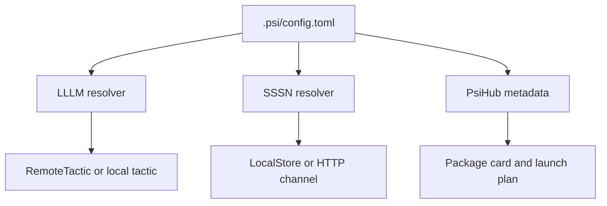

# Refs And Resolution

Refs let a caller name a tactic without deciding whether the implementation is
local, remote, native, Pydantic AI-backed, or wrapped by another service.

```text
psi://demo/briefs/tactics/brief
```

This is an identity. Resolution is a separate step.

## Local Registration

```python
from lllm import TacticResolver

resolver = TacticResolver()
resolver.register("psi://demo/briefs/tactics/brief", brief_tactic)

output = resolver.run(
    "psi://demo/briefs/tactics/brief",
    {"topic": "LLLM refs"},
)
```

Use direct registration in tests, notebooks, and local composition code where
the tactic object already exists.

## Remote Binding

The same ref can bind to a running service in `.psi/config.toml`:

```toml
[refs."psi://demo/briefs/tactics/brief"]
url = "http://127.0.0.1:8000"

[refs."psi://demo/briefs/services/api"]
url = "http://127.0.0.1:8000"
```

```python
resolver = TacticResolver.from_config(".")
tactic = resolver.resolve("psi://demo/briefs/tactics/brief")
```

The resolved tactic may be a `RemoteTactic`, but callers still use `run()`,
`arun()`, `stream()`, and `info()`.

## Mixed PSI Config

One local config can contain refs for multiple PSI layers:

```toml
[refs."psi://demo/briefs/tactics/brief"]
url = "http://127.0.0.1:8000"

[refs."psi://demo/briefs/services/api"]
url = "http://127.0.0.1:8000"

[refs."psi://demo/briefs/channels/events"]
store = ".sssn"
```

LLLM reads tactic and service URL bindings. SSSN reads channel/store bindings.
PsiHub can generate the config template. No layer has to launch another layer's
processes.



## Target Rules

A tactic binding with a concrete target uses `url`:

```toml
[refs."psi://demo/briefs/tactics/brief"]
url = "http://127.0.0.1:8000"
```

Do not also set `store`, `path`, or `object` on a URL-bound tactic ref. Those
target shapes belong to other layers or to direct in-process registration.

URL targets must be absolute HTTP(S) URLs without embedded credentials, query
strings, fragments, URL params, percent escapes, repeated slashes, dot
segments, backslashes, or colons in the path.

## Metadata

Use nested metadata tables for structured binding details:

```toml
[refs."psi://demo/briefs/tactics/brief".metadata]
timeout_s = 30
api_key_ref = "openai.default"
```

Resolver-owned `ref` and remote `url` fields remain canonical. Metadata must
not contain raw secret-shaped keys such as `api_key`, `token`, `password`,
`cookie`, `authorization`, or `credential`.
