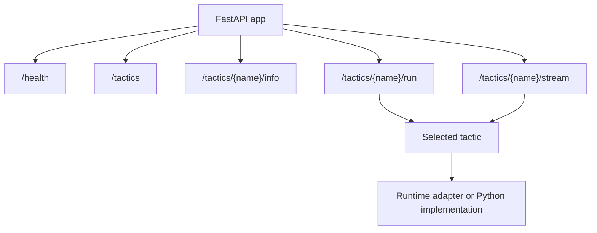

# Service Boundary

An LLLM service is the network face of one or more tactics. It is intentionally
thin: FastAPI handles transport, the tactic handles work, and the protocol
envelope keeps the call shape portable.

The v1 docs introduced service specs as deployable program surfaces. In v2,
`create_tactic_app()` and `create_service_app()` expose tactic objects
directly.

## One Tactic Service

```python
from lllm.services import create_tactic_app
from demo.tactics import EchoTactic

app = create_tactic_app(EchoTactic())
```

```bash
uvicorn demo.app:app --host 127.0.0.1 --port 8000
```

Portable routes:

| Route | Use |
| --- | --- |
| `GET /health` | Service health and tactic list. |
| `GET /info` | Single-tactic public contract. |
| `POST /run` | Single-tactic run call. |
| `POST /stream` | Single-tactic server-sent event stream. |

## Multi-Tactic Service

```python
from lllm.services import create_service_app

app = create_service_app(
    {
        "summarize": summarize_tactic,
        "classify": classify_tactic,
    },
    title="Briefing Service",
)
```

Multi-tactic routes:

| Route | Use |
| --- | --- |
| `GET /tactics` | List tactic contracts. |
| `GET /tactics/{name}/info` | Inspect one tactic. |
| `POST /tactics/{name}/run` | Run one tactic. |
| `POST /tactics/{name}/stream` | Stream one tactic. |



## Request Envelope

Use the envelope for new integrations:

```json
{
  "input": {"text": "hello"},
  "context": {"trace_id": "trace-1"}
}
```

Raw JSON is accepted for compatibility:

```json
{"text": "hello"}
```

The envelope is preferred because it gives the service a place to carry
request ids, trace ids, caller labels, and metadata without changing the input
schema.

## Response Envelope

`POST /run` returns:

```json
{
  "output": {"text": "HELLO"},
  "request_id": "req-...",
  "tactic": "echo"
}
```

Errors use a stable machine-readable shape:

```json
{
  "detail": {
    "error": {
      "type": "SchemaError",
      "message": "Invalid input.",
      "tactic": "echo",
      "endpoint": "run",
      "request_id": "req-...",
      "metadata": {}
    }
  }
}
```

## Custom Routes

Tactics may declare custom FastAPI routes with the `@endpoint` helpers. Custom
routes are useful for compatibility endpoints or narrow operational actions.

They must not shadow reserved LLLM routes such as `/run`, `/stream`, `/info`,
`/tactics/{name}/run`, or `/tactics/{name}/info`. Method/path pairs must stay
unique, and route metadata must use portable text.

## Remote Client

`RemoteTactic` turns a service URL back into a tactic-shaped object:

```python
from lllm.services import RemoteTactic

tactic = RemoteTactic("http://127.0.0.1:8000")
output = tactic.run({"text": "hello"})
```

This is why services stay thin. Composition code can depend on the tactic
boundary and decide later whether a ref resolves locally or over HTTP.
