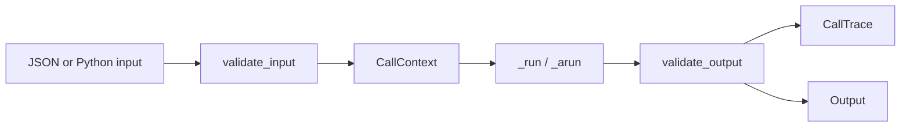

# Tactic Boundary

`Tactic` is LLLM's smallest compute boundary. It replaces the old docs'
`Program` concept: a typed unit of work that can run locally, run
async, stream, sit behind a service, and publish a portable description.

## Minimal Tactic

```python
from pydantic import BaseModel
from lllm import Tactic


class EchoInput(BaseModel):
    text: str


class EchoOutput(BaseModel):
    text: str


class EchoTactic(Tactic[EchoInput, EchoOutput]):
    name = "echo"
    input_type = EchoInput
    output_type = EchoOutput

    def _run(self, input_value, *, context=None):
        return EchoOutput(text=input_value.text.upper())
```

`run()` and `arun()` are the public boundary. They validate the input, create
or validate a `CallContext`, run the implementation, validate the output, and
optionally return a trace envelope.



## Public Call Paths

| Method | Use |
| --- | --- |
| `run(input_value, context=None)` | Synchronous local call. |
| `arun(input_value, context=None)` | Async local call. |
| `stream(...)` / `astream(...)` | Output chunks for streaming tactics. |
| `aevents(...)` | Full `TacticEvent` stream. |
| `info()` | Public `TacticInfo` contract. |

Use `return_trace=True` when a local caller wants the same request id, state,
latency, and error metadata that service calls expose.

```python
result = tactic.run(
    {"text": "hello"},
    context=CallContext(trace_id="trace-1"),
    return_trace=True,
)

assert result.trace.state == "success"
```

## Metadata Contract

`TacticInfo` is what services, package cards, and agent-readable catalogs
inspect:

- name and description,
- input and output schemas,
- capabilities such as `run`, `arun`, `stream`, and `events`,
- runtime kind,
- package and service refs,
- examples and public metadata.

Keep this data descriptive and portable. Put credentials in local config or
runtime-owned credential stores, not in tactic metadata.

## Validation Rules

The protocol keeps identifiers boring on purpose.

- Tactic names may be display names, but they must avoid path-control
  characters such as `/`, `\`, `:`, `%`, and `;`.
- Token-style fields such as request ids, event kinds, states, and error types
  must avoid whitespace and path-parameter separators.
- Metadata maps must use string keys and are copied at the boundary.
- Public service responses filter secret-shaped metadata keys.

These constraints make the same tactic safe to mention in URLs, config files,
package cards, and logs.

## Runtime Independence

A tactic can hide any implementation that can honor the boundary:

- `PydanticAITactic` for Pydantic AI agents,
- `NativeTacticAdapter` for native LLLM objects,
- `CallableTactic` for ordinary Python callables,
- `RemoteTactic` for already-running services,
- application-specific subclasses for custom logic.

The caller still sees the same `run`, `stream`, `info`, and schema behavior.
