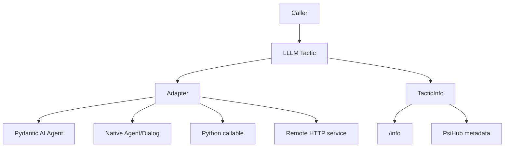

# Runtime

Runtime pages explain what owns execution behind the LLLM protocol boundary.

LLLM does not try to become every agent framework. It exposes a stable tactic
boundary and lets each runtime keep the machinery it is good at.

  

    <strong>Pydantic AI</strong>
    Agents, tools, model settings, deps, streaming, tracing, evals, and
    durable workflow features stay in Pydantic AI.
  

  

    <strong>Native LLLM</strong>
    Prompts, dialogs, agents, parser retries, tool interrupts, and invoker
    traces stay in the preserved native runtime.
  

  

    <strong>Plain Python</strong>
    Deterministic application logic can be wrapped as a tactic without an
    agent runtime.
  

  

    <strong>Remote</strong>
    Already-running HTTP services can resolve back into tactic-shaped clients.
  

## Boundary Rule

Adapters should translate runtime objects at the edge. They should not leak
runtime internals into the public service or package contract.

The old v1 docs called this the runtime adapter rule: keep framework features
inside the framework, and expose only the typed boundary to the rest of Psi.
That rule is still the heart of the current design.

## Runtime Comparison

| Runtime | Use when | LLLM boundary |
| --- | --- | --- |
| Pydantic AI | An agent owns model calls, tools, deps, tracing, evals, or graph state. | `PydanticAITactic` |
| Native LLLM | Prompt/dialog lineage and agent-call internals matter. | `NativeTacticAdapter` |
| Plain Python | The implementation is a callable or small class. | `CallableTactic` / `as_tactic()` |
| Remote service | The tactic already runs behind HTTP. | `RemoteTactic` |

## Surrounding Features

Runtime-owned surroundings are passed through when they belong at the call
boundary:

- Pydantic AI `run_kwargs`, metadata, output schemas, and stream result views.
- Native runtime kwargs, optional `CallContext`, safe metadata injection, and
  native stream iteration.
- Python callable context forwarding when the callable accepts `context`.
- Remote service envelopes and server-sent event streams.

The protocol remains small even when the runtime is rich.

## Next

- Use [Pydantic AI](pydantic-ai.md) for agent-backed tactics.
- Use [Native Runtime](native.md) when prompt/dialog/session lineage matters.
- Use [Plain Python](python.md) for deterministic work and small adapters.
