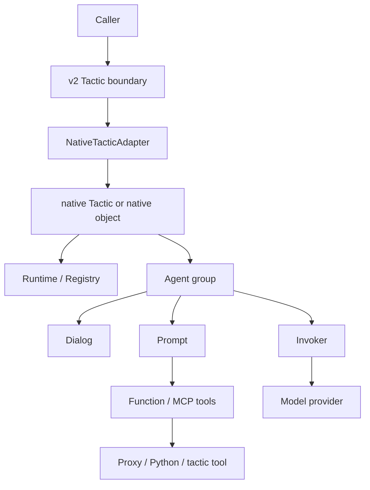

# Native Runtime

The native runtime is the restored LLLM v1 agent system inside the v2
protocol-first package. Use it when prompt rendering, parser repair, dialog
lineage, tool-call interrupts, invoker traces, or agent sessions are part of
the artifact you need to understand.

The v2 boundary stays small: public packages and services expose typed
tactics. Native keeps the transparent machinery behind that boundary.

```python
from lllm.runtimes.native import Dialog, Prompt, Role

system = Prompt(path="agent/system", prompt="You are a {style} assistant.")

dialog = Dialog(owner="planner")
dialog.put_prompt(system, prompt_args={"style": "careful"}, role=Role.SYSTEM)
dialog.put_text("Draft the next checkpoint.", name="operator")

retry = dialog.fork(last_n=1, first_k=1)
```

## Restored Shape

```text
lllm.runtimes.native
  core/        Agent, Dialog, Prompt, Runtime, Tactic, resources, config
  native/      NativeTactic and agent-backed tactic helpers
  invokers/    provider invocation boundary, including LiteLLM
  proxies/     API proxy tools and tactic-backed proxy endpoints
  sandbox/     optional Jupyter execution support
  tools/       optional computer-use helpers
```

## What Native Owns

| Area | Page |
| --- | --- |
| Prompts, tools, MCP declarations, dialogs, messages | [Prompt And Dialog](native/prompt-dialog.md) |
| Tagged parsers, repair handlers, function tools | [Parsers And Tools](native/parsers-tools.md) |
| Agent call loop, sessions, context management | [Agent Loop](native/agent-loop.md) |
| Resource registry, package discovery, provider invokers | [Registry And Invokers](native/registry-invokers.md) |
| Native tactic sessions and tactic-backed tools | [Native Tactics](native/tactics.md) |
| Adapter boundary into the v2 protocol | [V2 Adapter](native/adapter.md) |
| Proxies, skills, Jupyter, computer-use helpers | [Proxies, Skills, And Sandbox](native/proxies-skills-sandbox.md) |
| What was preserved, adapted, or kept out of public v2 | [Boundary And Verification](native/boundary-verification.md) |

## Architecture



Importing `lllm` does not import provider integrations. LiteLLM, Jupyter,
OpenAI computer-use helpers, Playwright, and proxy-specific packages remain
optional.

## When To Use Native

Use native when you need the inside of the agent turn:

- prompt templates with parsers, repair prompts, handlers, or tool contracts;
- dialog branching, replay, lineage, dataset generation, and debugging;
- function tools, MCP tool declarations, tactic-backed tools, and proxy tools;
- multi-agent tactics with per-agent sessions and cost accounting;
- provider invocation experiments through LiteLLM.

Use Pydantic AI or plain Python when the implementation does not need native
prompt/dialog/session machinery.
