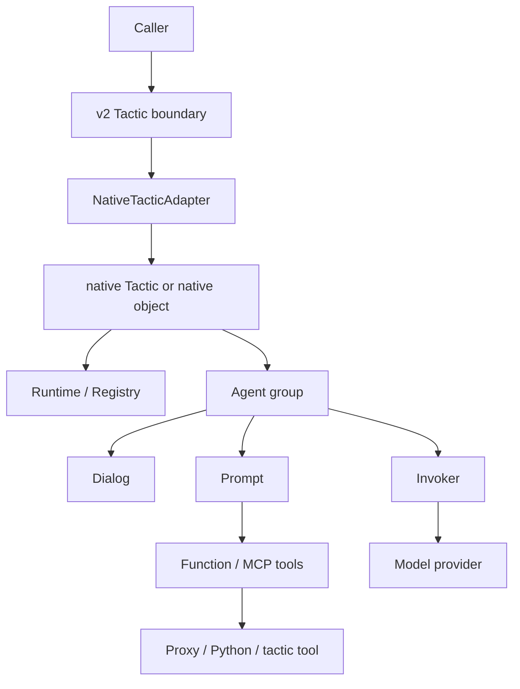
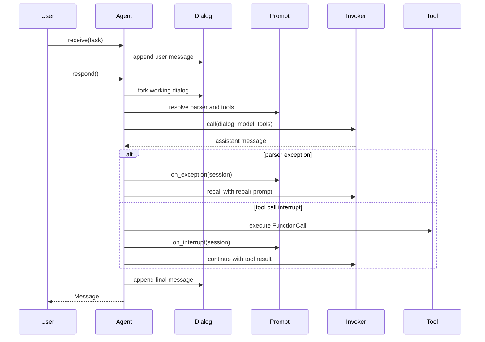

# Native Runtime

The native runtime is the restored LLLM v1 agent system inside the v2
protocol-first package. Use it when the prompt, parser, dialog tree, tool-call
interrupts, model invocation trace, or per-agent session is part of the thing
you want to study, reuse, or expose as a tactic.

The v2 boundary still stays small: public packages and services expose typed
tactics. Native keeps the transparent machinery behind that boundary.

```python
from lllm.runtimes.native import Dialog, Prompt, Role

system = Prompt(path="agent/system", prompt="You are a {style} assistant.")

dialog = Dialog(owner="planner")
dialog.put_prompt(system, prompt_args={"style": "careful"}, role=Role.SYSTEM)
dialog.put_text("Draft the next checkpoint.", name="operator")

retry = dialog.fork(last_n=1, first_k=1)
```

## Overview

### When To Use Native

Use the native runtime for work that benefits from looking inside the agent
loop:

- prompt templates with custom parsers, repair prompts, or tool handlers;
- dialog branching, replay, lineage, dataset generation, and debugging;
- function tools, MCP tool declarations, tactic-backed tools, and proxy tools;
- multi-agent native tactics with per-agent session and cost accounting;
- provider invocation experiments through LiteLLM;
- optional sandbox, browser, API proxy, and skill workflows that are too
  runtime-specific for the public `Tactic` protocol.

Use the plain v2 `Tactic` protocol or the Pydantic AI runtime when the internal
agent loop does not matter and you only need a typed callable boundary.

### Restored V1 Surface

The native runtime is no longer a thin prompt/dialog primitive file. The v1
package shape is restored under `lllm.runtimes.native`:

```text
lllm.runtimes.native
  core/        Agent, Dialog, Prompt, Runtime, Tactic, resources, config
  native/      NativeTactic and agent-backed tactic helpers
  invokers/    provider invocation boundary, including LiteLLM
  proxies/     API proxy tools and tactic-backed proxy endpoints
  sandbox/     optional Jupyter execution support
  tools/       optional computer-use helpers
```

The most important preserved concepts are:

| Concept | v2 Location | What Is Preserved |
| --- | --- | --- |
| `Prompt` | `native.core.prompt` | Templates, metadata, structured output, parsers, renderers, tools, MCP declarations, addon args, and handler prompts. |
| `Function` and `tool` | `native.core.prompt` | JSON-schema tool declarations, callable binding, result processors, LiteLLM/OpenAI tool conversion, and name validation. |
| `MCP` | `native.core.prompt` | Remote MCP server declarations with approval mode and allowed-tool filters. |
| `DefaultTagParser` | `native.core.prompt` | XML blocks, fenced markdown blocks, signal tags, required-tag validation, and `ParseError` repair routing. |
| `DefaultSimpleHandler` | `native.core.prompt` | Exception repair prompts, tool-result interrupt prompts, and final interrupt-limit prompts. |
| `Message` | `native.core.dialog` | Roles, modalities, function calls, logprobs, parsed output, usage, metadata, model, API type, and cost. |
| `Dialog` | `native.core.dialog` | Append-only conversation state, prompt rendering, image messages, fork lineage, tree metadata, serialization, and cost summaries. |
| `Agent` | `native.core.agent` | Named dialogs, active-dialog switching, prompt/tool resolution, context management, provider calls, parser retries, tool interrupts, repeated-call checks, and final delivery. |
| `AgentCallSession` | `native.core.prompt` | Exception retries, interrupts, LLM recalls, invoke traces, delivery state, and accumulated cost for one agent response. |
| `Tactic` | `native.core.tactic` | Native callable object, input/output validation, batch calls, async compatibility, sub-tactic composition, observer hooks, and session accounting. |
| `TacticCallSession` | `native.core.tactic` | Per-tactic delivery, failures, traceback, agent sessions, sub-tactic sessions, and total cost. |
| `NativeTactic` | `native.native.tactic` | `agent_group` plus `agent_configs` creation of live native agents, lazy invokers, and tracked agent calls. |
| `Runtime` / `Registry` | `native.core.runtime` | Package/resource registry, typed resource helpers, lazy nodes, named registries, default namespace, and `lllm.toml` discovery. |
| Invokers | `native.invokers` | `BaseInvoker`, `BaseStreamHandler`, LiteLLM chat/responses support, tools, MCP, usage, cost, parser errors, and streaming callbacks. |
| Proxies | `native.proxies` | API endpoint metadata, proxy managers, `query_api_doc`, persistent interpreter tools, prompt injection, and tactic-backed proxy endpoints. |
| Optional surroundings | `native.sandbox`, `native.tools` | Jupyter notebook sessions and computer-use helpers behind optional dependencies. |

### Architecture



Native owns the inside of the turn: prompt rendering, dialog lineage, parser
retries, tool-call interrupts, invoker traces, session state, and native
resource loading. The v2 adapter owns the outside: typed input/output, service
metadata, package refs, and reusable tactic information.

Importing `lllm` does not import provider integrations. LiteLLM, Jupyter,
OpenAI computer-use helpers, Playwright, and proxy-specific packages remain
optional.

## Core Primitives

### Prompt Contract

`Prompt` is a complete behavior definition for one agent turn.

| Field | Purpose |
| --- | --- |
| `path` | Stable native prompt path and registry key. |
| `prompt` | Template text. The default renderer uses `str.format(**kwargs)`. |
| `metadata` | Versioning, provenance, experiment labels, or other JSON-like data. |
| `parser` | Callable parser or object with `parse(content, **runtime_args)`. |
| `format` | Structured output hint. Pydantic models are passed as response format when supported. |
| `function_list` | `Function` objects, tool resource refs, or tactic tool refs. |
| `mcp_servers_list` | MCP server declarations exposed as provider tools. |
| `addon_args` | Provider/runtime options such as web search or computer-use config. |
| `handler` | Repair and interrupt prompt generator. |
| `renderer` | Template renderer. Defaults to `StringFormatterRenderer`. |

```python
from lllm.runtimes.native import Prompt

prompt = Prompt(
    path="research/summarize",
    prompt="Summarize {topic} for {audience}.",
    metadata={"version": "v2"},
)

text = prompt(topic="native runtime", audience="maintainers")
assert "native runtime" in text
```

Literal braces in a default prompt template must be doubled as `{{` and `}}`.
`prompt.template_vars` records the required variables, and `prompt.validate_args`
returns missing variables before rendering.

#### Tools

A native `Function` has two halves:

- a schema shown to the model;
- an optional Python implementation called when the model emits a tool call.

```python
from lllm.runtimes.native import FunctionCall, Prompt, tool


@tool(
    description="Add two values.",
    prop_desc={"left": "Left value.", "right": "Right value."},
)
def add(left: int, right: int = 1) -> int:
    return left + right


prompt = Prompt(
    path="math/solve",
    prompt="Solve {question}. Use tools if helpful.",
    function_list=[add],
)

call = add(FunctionCall(name="add", arguments={"left": 2, "right": 3}))
assert call.result == 5
```

`Function.from_callable()` inspects signatures and type hints. Tool names are
validated so they can be used safely in provider payloads and resource refs.
`Function.to_tool()` returns a copy of a LiteLLM/OpenAI-compatible tool schema,
so mutating the returned dictionary does not mutate the original prompt.

String entries in `function_list` are resolved at call time:

```python
prompt = Prompt(
    path="review/main",
    prompt="Review this patch.",
    function_list=[
        "shared.tools:search_code",
        "shared.tactics:lint_patch",
    ],
)
```

Regular tool refs bind to registered `Function` resources. Tactic refs are
wrapped as native `Function` tools with `tactic_as_function()`.

#### MCP Servers

Native prompts can also declare MCP servers:

```python
from lllm.runtimes.native import MCP, Prompt

prompt = Prompt(
    path="docs/search",
    prompt="Search the docs when needed.",
    mcp_servers_list=[
        MCP(
            server_label="docs",
            server_url="https://example.invalid/mcp",
            require_approval="manual",
            allowed_tools=["search"],
        )
    ],
)
```

`MCP.to_tool()` converts the declaration for LiteLLM. Approval mode is
validated as `never`, `manual`, or `auto`.

### Parsing And Repair

The restored default parser understands XML blocks, fenced markdown blocks,
and signal tags:

```python
from lllm.runtimes.native import DefaultTagParser, Prompt

parser = DefaultTagParser(
    required_xml_tags=["answer"],
    md_tags=["python"],
    signal_tags=["DONE"],
)

prompt = Prompt(
    path="analysis/tagged",
    prompt="Return <answer>...</answer>. Put code in ```python blocks.",
    parser=parser,
)

parsed = prompt.parse(
    "<answer>Use the native runtime.</answer>\n"
    "```python\nprint('ok')\n```\n"
    "<DONE>"
)

assert parsed["xml_tags"]["answer"] == ["Use the native runtime."]
assert parsed["signal_tags"]["DONE"] is True
```

If required tags are missing, `DefaultTagParser` raises `ParseError`. The agent
loop records the exception on `AgentCallSession`, appends the prompt returned
by `prompt.on_exception(session)`, and recalls the model until the exception
retry cap is reached.

Handlers are native prompt objects too. `DefaultSimpleHandler` creates:

- an exception prompt with `Error: {error_message}. Please fix.`;
- a tool-result prompt with `{call_results}`;
- a final prompt when the tool-call limit is reached.

Replace `handler` when parser repair or tool-result feedback needs richer
behavior.

### Dialog And Message Model

`Dialog` is append-only conversation state. It owns the rendered messages, the
top prompt, runtime reference, session name, and tree metadata.

```python
from lllm.runtimes.native import Dialog, Prompt, Role

prompt = Prompt(path="assistant/system", prompt="You are concise.")

dialog = Dialog(owner="assistant", session_name="demo")
dialog.put_prompt(prompt, role=Role.SYSTEM, name="system")
dialog.put_text("Explain the native dialog model.", role=Role.USER)

child = dialog.fork(last_n=1, first_k=1)

assert child.parent is dialog
assert child.tree_node.parent_id == dialog.dialog_id
assert dialog.tree_node.children_ids == [child.dialog_id]
```

Messages preserve:

- `role`, `content`, `name`, and sanitized provider-safe names;
- text and image modalities;
- function calls and tool-call metadata;
- model id, API type, parsed output, logprobs, vectors, usage, and metadata;
- cost computed from usage fields.

`Dialog.put_image()` accepts a base64 string, file path, bytes, or PIL image
when image support is installed. Forking keeps lineage through
`DialogTreeNode`, including `parent_id`, `children_ids`, `split_point`,
`first_k`, `last_n`, and subtree traversal helpers. `overview()` and
`tree_overview()` are useful for debugging without printing full messages.

## Agent Runtime

### Agent Call Flow

The old agent-call figure belongs here because native still carries the full
agent loop.



`Agent` owns named dialogs:

```python
from lllm.runtimes.native import Agent, Prompt
from lllm.runtimes.native.invokers import build_invoker

agent = Agent(
    name="writer",
    system_prompt=Prompt(path="writer/system", prompt="You write clear notes."),
    model="gpt-4o-mini",
    llm_invoker=build_invoker({"invoker": "litellm"}),
)

agent.open("draft")
agent.receive("Write a short project update.")
response = agent.respond()
```

Use `return_session=True` to inspect the full call:

```python
session = agent.respond(return_session=True)

print(session.state)
print(session.exception_retries_count)
print(session.llm_recalls_count)
print(session.cost)
print(session.delivery.content)
```

`AgentCallSession` records exception retries, tool interrupts, LLM recalls,
every `InvokeResult`, final delivery, failure state, and cost. This is the
diagnostic material that was lost when native was reduced to a thin v2
primitive.

The loop performs these steps:

1. Resolve tool refs on `dialog.top_prompt`.
2. Fork a working dialog so parser-repair prompts do not pollute the main
   dialog unless the invocation succeeds.
3. Apply an optional `ContextManager`.
4. Call the invoker with merged `model_args` and per-call args.
5. Append assistant messages to the working dialog and record the invoke trace.
6. If parsing fails, call the exception handler and retry.
7. If the model emits tool calls, execute each `Function`, add tool-result
   messages, detect repeated identical calls, and continue.
8. If the message is final, append it to the real dialog and mark the session
   successful.

`max_exception_retry`, `max_interrupt_steps`, and `max_llm_recall` cap the
repair, tool, and provider-recall loops.

### Context Management

Native context managers transform a dialog before each provider call. The
built-in `DefaultContextManager` truncates old messages to stay within a model
context window.

```python
from lllm.runtimes.native.core.dialog import DefaultContextManager

agent.context_manager = DefaultContextManager(
    model_name="gpt-4o-mini",
    max_tokens=128000,
)
```

Custom context managers subclass `ContextManager` and can be registered on the
native runtime:

```python
runtime.register_context_manager(SummaryCompressor)
```

Then native agent config can reference it:

```yaml
context_manager:
  type: summary
  max_tokens: 64000
```

### Invokers And Streaming

`BaseInvoker.call()` is the provider boundary:

```python
invoke_result = invoker.call(
    dialog,
    model="gpt-4o-mini",
    model_args={"temperature": 0.2},
    parser_args={},
    responder="assistant",
)
```

It returns `InvokeResult`, which contains:

- the raw provider response;
- actual model args sent after native merging;
- parser or execution errors;
- the resulting native `Message`;
- cost through `invoke_result.cost`.

`LiteLLMInvoker` converts a native `Dialog` into provider-compatible messages.
It preserves assistant tool calls, tool messages, image messages, prompt
functions, MCP servers, structured output hints, logprobs, usage, cost, and
chat-vs-responses API differences.

Streaming uses `BaseStreamHandler`:

```python
from lllm.runtimes.native.invokers.base import BaseStreamHandler


class PrintStream(BaseStreamHandler):
    def handle_chunk(self, chunk_content: str, chunk_response):
        print(chunk_content, end="", flush=True)


agent.stream_handler = PrintStream()
message = agent.respond()
```

Provider support is optional:

```bash
python -m pip install -e ".[native]"
```

LiteLLM checks common provider environment variables at import time and raises
clear errors for partial Vertex AI, NVIDIA NIM, or Azure configuration. No
provider key is required for offline prompt, dialog, parser, registry, and
adapter tests.

## Native Tactics

### Agent-Backed Tactics

The restored native `Tactic` is the callable runtime object used by native
workflows. It supports input/output validation, sync and async calls, batch
calls, sub-tactic composition, observer hooks, and a `TacticCallSession` for
each invocation.

Subclass `NativeTactic` when a tactic should build live native agents from
config.

```python
from lllm.runtimes.native import NativeTactic


class BriefTactic(NativeTactic):
    name = "brief"
    input_type = str
    output_type = str
    agent_group = ["writer"]

    def call(self, task: str) -> str:
        writer = self.agents["writer"]
        writer.open("draft", prompt_args={"topic": task})
        writer.receive(task)
        return writer.respond().content
```

Config supplies the invoker, global defaults, and per-agent settings:

```python
config = {
    "invoker": "litellm",
    "global": {
        "model_args": {"temperature": 0.1},
        "max_exception_retry": 3,
        "max_interrupt_steps": 5,
        "max_llm_recall": 0,
    },
    "agent_configs": [
        {
            "name": "writer",
            "model_name": "gpt-4o-mini",
            "system_prompt": "You write concise briefs about {topic}.",
        }
    ],
}

tactic = BriefTactic(config=config)
```

The parser reads these agent keys:

| Key | Meaning |
| --- | --- |
| `name` | Agent name. Must match an entry in `agent_group`. |
| `model_name` | Provider model id passed to the invoker. |
| `system_prompt` | Inline prompt string. |
| `system_prompt_path` | Prompt resource path loaded from the native runtime. |
| `api_type` | `completion` or `response`. |
| `model_args` | Provider args such as temperature, token limits, headers, or skills payloads. |
| `max_exception_retry` | Parser/validation repair cap. |
| `max_interrupt_steps` | Tool-call loop cap. |
| `max_llm_recall` | Provider/API error recall cap. |
| `tools` | Tool, tactic, or proxy refs to add to the prompt. |
| `proxy` | Proxy manager and execution-tool settings. |
| `context_manager` | Built-in or registered context manager config. |
| `skills` | Local, URL, wildcard, or provider-hosted skill entries. |
| `extra_settings` | Native-specific settings reserved for tactic code. |

`NativeTactic` creates a fresh tracked agent group per call. The internal
`_TrackedAgent` wrapper records each `agent.respond()` call into the current
`TacticCallSession`, so `session.summary()` includes agent-call counts and
total cost.

```python
session = tactic("Summarize the native runtime.", return_session=True)

print(session.state)
print(session.summary())
print(session.agent_sessions["writer"][0].delivery.content)
```

### Tactics As Tools

Native can consume a protocol tactic as a prompt tool:

```python
from lllm.runtimes.native import Prompt, tactic_as_function

lookup = tactic_as_function(search_tactic, parameter_mode="kwargs")
prompt = Prompt(
    path="research/answer",
    prompt="Use tools when needed.",
    function_list=[lookup],
)
```

Native tactics can also expose ordinary callable tools for Pydantic AI and
other runtimes:

```python
tool_callable = tactic.as_tool(parameter_mode="task")
```

For methods on a native tactic class, use `@tactictool` when a method should be
discoverable as a native tool resource. Selector refs can use `#tool_name` to
refer to a method-level tool.

### Crossing Into V2

Use `NativeTacticAdapter` when a native object should be exposed as a v2
protocol tactic:

```python
from lllm.runtimes.native import NativeTacticAdapter

public_tactic = NativeTacticAdapter(
    native_tactic,
    package_ref="psi://demo/native/tactics/brief",
)
```

The service layer sees v2 `TacticInfo`. Native prompts, dialogs, sessions, and
invokers stay behind the adapter.

The adapter also carries runtime-owned surrounding data without making it part
of the public protocol:

```python
from lllm import CallContext
from lllm.runtimes.native import NativeTacticAdapter

tactic = NativeTacticAdapter(
    native_tactic,
    run_kwargs={"tone": "precise"},
)

result = tactic.run(
    {"topic": "native services"},
    context=CallContext(trace_id="trace-1", metadata={"caller": "demo"}),
)
```

If the native method accepts `context`, it receives the `CallContext`. If it
accepts `metadata`, the adapter adds safe LLLM metadata such as request id,
trace id, refs, endpoint, and tags.

## Packages And Surroundings

### Runtime Registry And Packages

The native `Runtime` is a registry of `ResourceNode` objects keyed by qualified
refs:

```text
<package>.<section>:<resource_path>
```

Examples:

```text
demo.prompts:writer/system
demo.tools:search
demo.tactics:brief
demo.proxies:market_data
demo.configs:writer
demo.assets:logo.png
```

Typed helpers keep common access readable:

```python
from lllm.runtimes.native import Prompt, Runtime, tool
from lllm.runtimes.native.core import load_prompt, load_tool

runtime = Runtime()

prompt = Prompt(path="writer/system", prompt="You are concise.")
runtime.register_prompt(prompt, namespace="demo.prompts")


@tool(description="Echo text.")
def echo(text: str) -> str:
    return text


runtime.register_tool("echo", echo, namespace="demo.tools")

assert load_prompt("demo.prompts:writer/system", runtime=runtime).path
assert load_tool("demo.tools:echo", runtime=runtime).name == "echo"
```

Resource categories are intentionally split:

| Category | Resource Types |
| --- | --- |
| Platform | `tactic`, `service`, `config`, `asset` |
| Native | `prompt`, `tool`, `proxy`, `context_manager` |
| Custom | User-defined sections discovered from `lllm.toml` |

Native package discovery reads `lllm.toml`, not `psi.toml`:

```toml
[package]
name = "demo"
version = "0.1.0"
description = "Native runtime demo."

[prompts]
paths = ["prompts"]

[tools]
paths = ["tools"]

[tactics]
paths = ["tactics"]

[dependencies]
packages = ["../shared as shared"]
```

`load_runtime()` searches for `lllm.toml`, `.lllm.toml`, or `LLLM.toml`, loads
dependencies, registers resources, and can auto-discover standard folders when
no config file exists.

```python
from lllm.runtimes.native.core.runtime import load_runtime

runtime = load_runtime("lllm.toml", name="experiment")
```

Bare keys resolve through the runtime default namespace. Full keys always work
and are preferred in docs and packages because they are unambiguous.

### Proxies And Interpreter Tools

The v1 proxy system is preserved as a native-only surrounding. A proxy class
describes endpoint metadata with `BaseProxy.endpoint`, and `ProxyManager`
loads registered proxy resources.

```python
from lllm.runtimes.native.proxies import BaseProxy, ProxyRegistrator


@ProxyRegistrator(
    path="demo",
    name="Demo API",
    description="Small local proxy used in examples.",
)
class DemoProxy(BaseProxy):
    @BaseProxy.endpoint(
        category="demo",
        endpoint="lookup",
        name="lookup",
        description="Look up a local value.",
        params={"key": (str, "alpha")},
        response=[{"value": "str"}],
    )
    def lookup(self, params=None):
        params = params or {}
        return {"value": params.get("key", "")}
```

When an agent has proxy config, native can inject:

- `query_api_doc(proxy_name)` for endpoint documentation;
- `run_python(code)` when `exec_env` is `interpreter`;
- a rendered API-directory block into the system prompt.

`AgentInterpreter` is intentionally lightweight: it uses `exec()` in a
persistent namespace, injects `CALL_API`, captures stdout, truncates long
output, and returns tracebacks as tool output. Use it for trusted agent
workflows and swap the backend when stronger isolation is required.

Proxy config can be global or per-agent:

```yaml
proxy:
  activate_proxies: [demo]
  deploy_mode: false
  cutoff_date: "2024-01-01"
  exec_env: interpreter
  max_output_chars: 5000
  truncation_indicator: "... (truncated)"
  timeout: 60.0
```

`exec_env: jupyter` keeps the API docs but leaves code execution to a tactic
using the Jupyter sandbox. `exec_env: null` injects API awareness without a
runtime execution tool.

### Skills

Native agent config preserves progressive skill disclosure:

```yaml
skills:
  - pdf
  - commit-review
```

Local skills are discovered from standard project and user directories such as
`.agents/skills/<name>/SKILL.md` and `.claude/skills/<name>/SKILL.md`. A compact
catalog is appended to the system prompt, and an `activate_skill(name)` tool
loads full instructions on demand.

`skills: "*"` exposes all discovered local skills. URL entries are fetched as
remote `SKILL.md` files. Provider-hosted skill ids that start with `skill_` are
passed through as model args for compatible Anthropic models instead of being
materialized as local text.

### Sandbox And Computer Use

Optional native surroundings are preserved, but they are not part of the
runtime-neutral v2 tactic protocol.

| Area | Module | Notes |
| --- | --- | --- |
| Jupyter sessions | `lllm.runtimes.native.sandbox.jupyter` | Notebook file management, kernel execution, markdown/code cells, and optional proxy-aware init code. |
| In-process interpreter | `lllm.runtimes.native.proxies.interpreter` | Persistent Python namespace for trusted proxy workflows. |
| Computer use | `lllm.runtimes.native.tools.cua` | Browser automation helpers using OpenAI/Azure clients and Playwright when installed. |
| Response API tools | `LiteLLMInvoker` | `Prompt.addon_args` can request web-search or computer-use tools for response API calls. |

Install only the extras you need. Offline native tests do not require live
providers, Jupyter, Playwright, or proxy API credentials.

## Boundary And Verification

### V2 Boundary

Most v1 native concepts are preserved, but their ownership changed:

| Old Assumption | v2 Treatment |
| --- | --- |
| Native runtime is the center of LLLM | Native is one runtime behind the protocol `Tactic` boundary. |
| Native resources define public package metadata | PsiHub owns `psi.toml`; native package discovery still reads `lllm.toml`. |
| Provider, sandbox, and proxy deps are core deps | They are lazy optional integrations. |
| Live builtin proxies are normal tests | Builtins are restored, but live API behavior stays opt-in and credential-gated. |
| Native agent sessions are protocol fields | Sessions remain native diagnostics; the public protocol returns typed tactic results. |
| Streaming/events are always available | Native reports stream/event support only when the tactic implementation provides it. |

This lets the v1 runtime stay rich without forcing Pydantic AI, plain Python,
service-only, or package-index users to inherit native-specific concepts.

### Examples

- `examples/native_dialog/demo.py` shows prompt/dialog lineage.
- `examples/native_service/` serves an offline native prompt/dialog workflow
  through the v2 FastAPI API.
- `docs/tutorials/native-core.md` walks through Prompt, Tools, Parser, Dialog,
  Runtime, Agent, and Native Tactic usage.
- `docs/reference/native-preservation.md` records what was ported, adapted,
  cut from public v2, or deferred for live verification.

```bash
uvicorn app:app --app-dir examples/native_service --reload
```

### Install And Verify

Install provider support only when you need live model calls:

```bash
python -m pip install -e ".[native]"
```

Useful checks while editing native docs or runtime code:

```bash
uv run --extra docs mkdocs build --strict --site-dir /tmp/lllm-native-site
uv run --extra dev python -m pytest tests/test_docs_rendering.py -q
```
