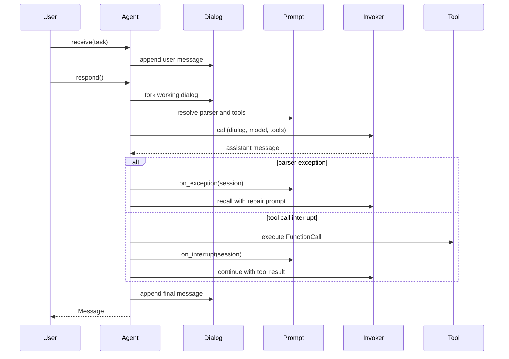

# Agent Loop

Native `Agent` owns named dialogs and runs the v1 parser/tool/recall loop.
This is the page to read when you need to debug an individual model turn.

## Call Flow



## Named Dialogs

```python
from lllm.runtimes.native import Agent, Prompt
from lllm.runtimes.native.invokers import build_invoker

agent = Agent(
    name="writer",
    system_prompt=Prompt(path="writer/system", prompt="You write clear notes."),
    model="gpt-4o-mini",
    llm_invoker=build_invoker({"invoker": "litellm"}),
)

agent.open("draft")
agent.receive("Write a short project update.")
response = agent.respond()
```

Agents can `open`, `fork`, `switch`, and `close` dialogs by alias. `receive`,
`receive_prompt`, and `receive_image` add user-side material to the active
dialog.

## AgentCallSession

Use `return_session=True` when you need the full diagnostic trace:

```python
session = agent.respond(return_session=True)

print(session.state)
print(session.exception_retries_count)
print(session.llm_recalls_count)
print(session.cost)
print(session.delivery.content)
```

`AgentCallSession` records exception retries, tool interrupts, LLM recalls,
every `InvokeResult`, final delivery, failure state, and cost.

## Loop Steps

1. Resolve tool refs on `dialog.top_prompt`.
2. Fork a working dialog so parser-repair prompts do not pollute the main
   dialog unless the invocation succeeds.
3. Apply an optional `ContextManager`.
4. Call the invoker with merged `model_args` and per-call args.
5. Append assistant messages to the working dialog and record the invoke trace.
6. If parsing fails, call the exception handler and retry.
7. If the model emits tool calls, execute each `Function`, add tool-result
   messages, detect repeated identical calls, and continue.
8. If the message is final, append it to the real dialog and mark the session
   successful.

`max_exception_retry`, `max_interrupt_steps`, and `max_llm_recall` cap the
repair, tool, and provider-recall loops.

## Context Management

Native context managers transform a dialog before each provider call. The
built-in `DefaultContextManager` truncates old messages to stay within a model
context window.

```python
from lllm.runtimes.native.core.dialog import DefaultContextManager

agent.context_manager = DefaultContextManager(
    model_name="gpt-4o-mini",
    max_tokens=128000,
)
```

Custom context managers subclass `ContextManager` and can be registered on the
native runtime:

```python
runtime.register_context_manager(SummaryCompressor)
```
