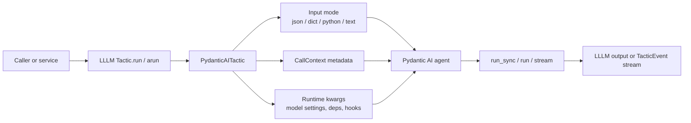

# Pydantic AI

Pydantic AI is the first-class agentic runtime target for LLLM. Configure the
agent normally, then wrap it as a tactic.

```python
from lllm.runtimes import PydanticAITactic

tactic = PydanticAITactic(
    agent,
    input_type=BriefInput,
    output_type=BriefOutput,
)
```

LLLM does not replace Pydantic AI. Pydantic AI still owns model execution,
tools, deps, model settings, streaming, tracing, eval hooks, graphs, and
durable workflow behavior. LLLM adds a reusable tactic boundary around the
agent.

## Agent Call Flow

The v1 docs described an agent call as the place where runtime-specific work
happens. In v2, that idea is preserved by keeping the Pydantic AI call inside
`PydanticAITactic`.



The boundary is one-way: LLLM prepares the call and validates the returned
value, while Pydantic AI keeps owning tools, providers, streaming internals,
tracing, and durable runtime state.

## Input Modes

`PydanticAITactic` accepts an `input_mode`:

| Mode | Behavior |
| --- | --- |
| `auto` | Pydantic models are sent as JSON; other values pass through. |
| `json` | Pydantic models are sent as JSON strings. |
| `dict` | Pydantic models are sent as JSON-compatible dictionaries. |
| `python` | Pydantic models are passed as Python objects. |
| `text` | Input is converted to text. |

Use the mode that matches your agent's expected task shape.

```python
tactic = PydanticAITactic(
    agent,
    input_type=BriefInput,
    output_type=BriefOutput,
    input_mode="dict",
)
```

## Output Modes

By default, the adapter unwraps common Pydantic AI result objects by reading
`result.output` or `result.data`. Set `result_mode="result"` when application
code wants the full runtime result object.

```python
tactic = PydanticAITactic(
    agent,
    output_type=BriefOutput,
    result_mode="output",
)
```

If the agent exposes `output_json_schema()`, `tactic.info()` uses it for the
public output schema.

## Runtime-Owned Settings

Use `run_kwargs` for settings that belong to Pydantic AI:

```python
tactic = PydanticAITactic(
    agent,
    input_type=BriefInput,
    output_type=BriefOutput,
    run_kwargs={
        "model_settings": {"temperature": 0},
        "deps": {"vector_store": "local"},
        "eval_hook": "offline-score",
    },
)
```

Call-time kwargs are merged on top:

```python
output = tactic.run(
    {"topic": "package refs"},
    durable_run_id="run-1",
    graph_node="planner.step",
)
```

These remain runtime-owned concepts. LLLM forwards them; it does not redefine
them as protocol fields.

## Context Metadata

When the selected agent method accepts a `metadata` keyword, the adapter can
forward safe LLLM context metadata:

```python
from lllm import CallContext

output = tactic.run(
    {"topic": "refs"},
    context=CallContext(trace_id="trace-1", metadata={"caller": "docs"}),
)
```

If the caller passes `metadata=` explicitly, LLLM does not overwrite it.
Disable automatic forwarding with `include_context_metadata=False`.

## Streaming

The adapter supports Pydantic AI stream methods when the agent provides them.
`stream_mode` controls how stream results are viewed:

| Mode | Use |
| --- | --- |
| `output` | Yield `stream_output()` chunks when available. |
| `text` | Yield text chunks when the runtime exposes text streaming. |
| `response` | Yield response objects. |
| `raw` | Yield the runtime object directly. |

`aevents()` delegates to `run_stream_events()` when the agent exposes it.

## Package Shape

Expose a Pydantic AI-backed tactic like any other tactic:

```toml
[tactics.brief]
entry = "demo.agent:build_tactic"
input = "brief_input"
output = "brief_output"
runtime = "pydantic-ai"
description = "Write a structured brief."
```

The entrypoint can return a ready `PydanticAITactic` or a factory that builds
one. Package cards should describe behavior, dependencies, and safe examples,
not provider secrets.

## Native Tactics As Tools

Any LLLM tactic can become a callable for Pydantic AI's tool system:

```python
from lllm.runtimes import tactic_as_tool

tool = tactic_as_tool(search_tactic, parameter_mode="kwargs")
```

This bridge does not replace Pydantic AI tools. It only gives Pydantic AI a
normal callable backed by an LLLM tactic.

## Examples

Executable offline examples:

- `examples/pydantic_ai_tactic/structured_agent.py`
- `examples/pydantic_ai_tactic/surrounding_features.py`

The examples use fake agents so the docs and tests run without provider keys.
