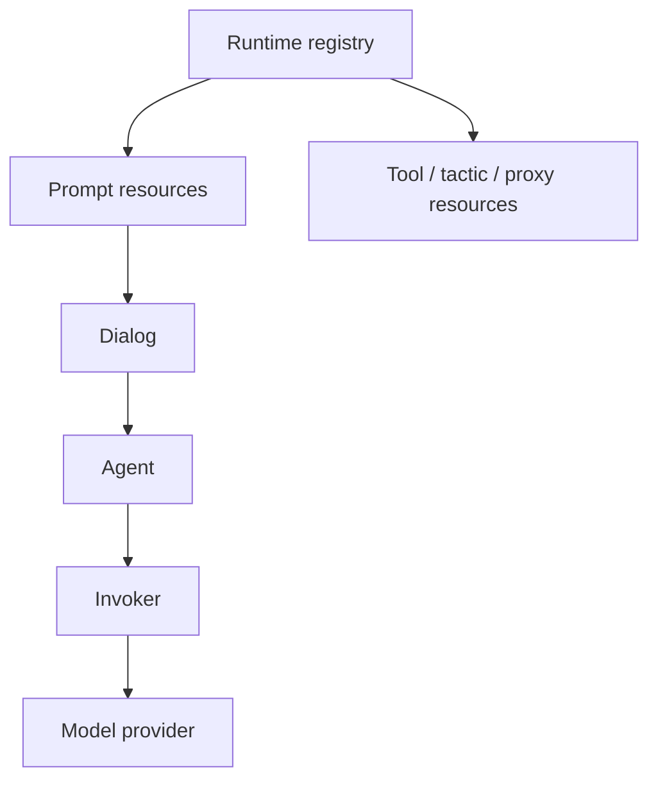

# Native Core

Goal: build a native prompt/dialog workflow, inspect its lineage, attach tools,
and understand where the full native agent runtime begins.

## Prerequisites

For offline prompt, dialog, parser, registry, and tactic tests:

```bash
python -m pip install -e ".[dev]"
```

For live native agents through LiteLLM:

```bash
python -m pip install -e ".[dev,native]"
```

## Files Used

```text
examples/native_dialog/demo.py
examples/native_service/tactics.py
tests/test_native_core.py
tests/test_native_adapter.py
```

The tutorial is written so the core pieces run without provider credentials.

## Mental Model

Native runtime has four layers:



- `Prompt` describes one behavior contract.
- `Dialog` stores messages and branch lineage.
- `Agent` owns named dialogs and runs the parser/tool/recall loop.
- `Runtime` registers prompts, tools, proxies, tactics, and config resources.

## Prompt

Start with a prompt template. Native prompts track template variables, metadata,
parser objects, local tools, MCP server declarations, and handler prompts.

```python
from lllm.runtimes.native import Prompt

system = Prompt(
    path="planner/system",
    prompt="You are a {style} planning assistant.",
    metadata={"version": "demo"},
)

assert system.template_vars == {"style"}
assert system(style="careful") == "You are a careful planning assistant."
```

Prompts can be extended while keeping the surrounding behavior:

```python
brief = system.extend(
    path="planner/brief",
    prompt="Write a short plan for {project}.",
)

assert brief(project="LLLM") == "Write a short plan for LLLM."
```

## Tools

Native tools are `Function` records with JSON-schema-compatible properties and
an optional Python implementation.

```python
from lllm.runtimes.native import FunctionCall, tool


@tool(description="Add two values", prop_desc={"left": "Left side"})
def add(left: int, right: int = 1) -> int:
    return left + right


call = add(FunctionCall(name="add", arguments={"left": 2, "right": 3}))

assert call.success
assert call.result == 5
assert add.to_tool()["function"]["parameters"]["required"] == ["left"]
```

Attach tools to prompts:

```python
tool_prompt = Prompt(
    path="math/solve",
    prompt="Solve {question}. Use tools if useful.",
    function_list=[add],
)

assert "add" in tool_prompt.functions
```

## Parser

The default parser extracts XML blocks, fenced markdown blocks, and signal tags.

```python
from lllm.runtimes.native import DefaultTagParser, ParseError

parser = DefaultTagParser(
    required_xml_tags=["answer"],
    required_md_tags=["json"],
    signal_tags=["DONE"],
)

parsed = parser.parse(
    "<answer>Hello</answer>\n"
    "```json\n"
    '{"ok": true}\n'
    "```\n"
    "<DONE>"
)

assert parsed["xml_tags"]["answer"] == ["Hello"]
assert parsed["signal_tags"]["DONE"] is True
```

If a required block is missing, the parser raises `ParseError`. The native
agent loop records that in `AgentCallSession` and can use the prompt's
exception handler to recall the model.

## Dialog

A dialog is an append-only transcript with explicit branch metadata.

```python
from lllm.runtimes.native import Dialog, Role

dialog = Dialog(owner="planner")
dialog.put_prompt(system, prompt_args={"style": "careful"}, role=Role.SYSTEM)
dialog.put_text("Plan the next checkpoint.", name="operator")

retry = dialog.fork(last_n=1, first_k=1)

assert retry.parent is dialog
assert retry.depth == 1
assert retry.head.content == "You are a careful planning assistant."
assert retry.tail.content == "Plan the next checkpoint."
```

Round-trip serialization keeps lineage:

```python
restored = Dialog.from_dict(dialog.to_dict())

assert restored.head.content == dialog.head.content
assert restored.children[0].parent is restored
```

## Runtime Registry

Use `Runtime` when prompts, tools, proxies, configs, and tactics should be
resolved by resource keys.

```python
from lllm.runtimes.native import Runtime

runtime = Runtime()
runtime.register_prompt(system)

loaded = runtime.get_prompt("planner/system")
assert loaded(style="direct") == "You are a direct planning assistant."
```

Native package loading builds on this registry. Bare refs can resolve through
the default namespace, while package refs can address resources explicitly.

## Agent Dialogs

An `Agent` owns named dialogs. You can open, switch, fork, and close dialogs
without making a model call.

```python
from lllm.runtimes.native import Agent

agent = Agent(
    name="planner",
    system_prompt=system,
    model="fake-model",
    llm_invoker=object(),  # replaced by a real invoker for respond()
)

agent.open("main", prompt_args={"style": "careful"})
agent.receive("Break the work into steps.", name="operator")
agent.fork("main", "retry", last_n=1, first_k=1)

assert agent.active_alias == "retry"
assert sorted(agent.dialogs) == ["main", "retry"]
```

For live calls, install `.[native]` and build a LiteLLM invoker:

```python
from lllm.runtimes.native.invokers import build_invoker

invoker = build_invoker({"invoker": "litellm"})
agent.llm_invoker = invoker
```

Then `agent.respond()` runs the full native loop: context management, invoker
call, parser validation, tool interrupts, exception prompts, recalls, and final
dialog append.

## Native Tactic

The native `Tactic` is the old runtime's callable unit. It tracks per-call
sessions, validates optional input/output schemas, and can expose methods as
tools.

```python
from lllm.runtimes.native import Tactic, tactictool


class EchoTactic(Tactic):
    name = "echo"
    input_type = str
    output_type = str

    @tactictool("shout", description="Uppercase text")
    def shout(self, text: str) -> str:
        return text.upper()

    def call(self, task: str) -> str:
        return f"echo: {task}"


tactic = EchoTactic()
assert tactic("hello") == "echo: hello"
assert tactic.as_tool()(task="hello") == "echo: hello"
```

Use `NativeTactic` when the tactic should build an agent group from config.
Use `NativeTacticAdapter` when that native object should cross the v2 service
or package boundary.

## Protocol Tactic As Native Function

Native prompts can call a v2 protocol tactic through a `Function` wrapper:

```python
from pydantic import BaseModel

from lllm.runtimes.native import FunctionCall, tactic_as_function
from lllm.runtimes.python import as_tactic


class AddInput(BaseModel):
    left: int
    right: int


def add_task(task: AddInput) -> int:
    return task.left + task.right


add_tactic = as_tactic(add_task, name="adder")
add_function = tactic_as_function(add_tactic, parameter_mode="kwargs")

call = add_function(FunctionCall(
    name="adder",
    arguments={"left": 2, "right": 4},
))

assert call.result == 6
```

This is useful when native prompt/tool loops need to call logic that is already
packaged as a v2 tactic.

## Verify

```bash
uv run --extra dev python -m pytest \
  tests/test_native_core.py \
  tests/test_native_adapter.py \
  -q
```

Expected output:

```text
... passed
```

Next, wrap a native workflow with `NativeTacticAdapter` when it needs to cross
the package or service boundary.

## Serve A Native Workflow

`examples/native_service/tactics.py` shows the same idea as a service-ready
tactic. The native object is still a native `Tactic`, so it can build prompts,
dialogs, tools, and agent sessions internally. The adapter exposes only the v2
contract.

```python
from lllm.runtimes.native import NativeTacticAdapter

public_tactic = NativeTacticAdapter(
    native_tactic,
    package_ref="psi://demo/native-service/tactics/native-brief",
    run_kwargs={"tone": "precise"},
)
```

Serve it with the normal service helper:

```python
from lllm.services import create_tactic_app

app = create_tactic_app(public_tactic)
```

Then call `/run` with a protocol envelope:

```bash
curl -X POST http://127.0.0.1:8000/run \
  -H 'content-type: application/json' \
  -d '{"input":{"topic":"native services"},"context":{"trace_id":"trace-demo"}}'
```

The returned payload is a typed v2 output, but the transcript was produced by
native `Prompt` and `Dialog` objects behind the boundary.
