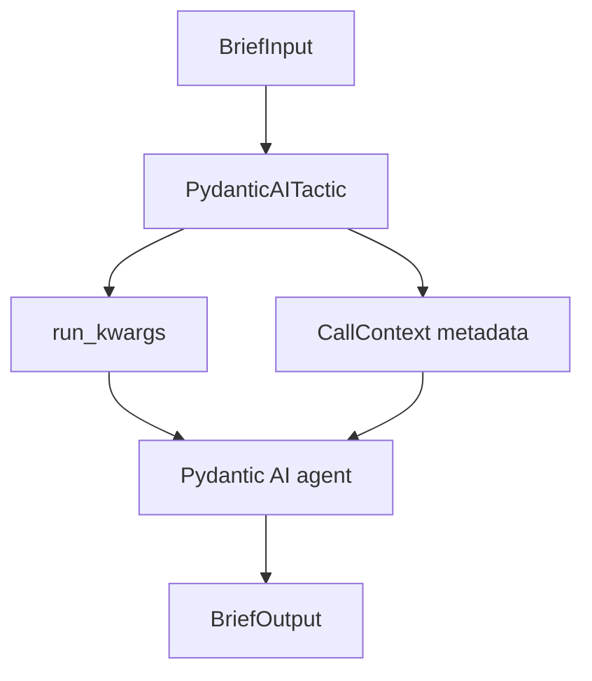

# Pydantic AI Runtime

Goal: wrap a Pydantic AI-style agent as an LLLM tactic, preserve runtime-owned
features, serve it over HTTP, and expose it as a callable tool.

This tutorial uses the offline fake agents in `examples/pydantic_ai_tactic/`
so it runs without provider keys. Replace the fake agent with a real
`pydantic_ai.Agent` when you want live model calls.

## Prerequisites

```bash
python -m pip install -e ".[dev]"
```

## Files Used

```text
examples/pydantic_ai_tactic/
  fake_agent.py
  structured_agent.py
  surrounding_features.py
tests/
  test_pydantic_ai_adapter.py
  test_examples.py
```

## 1. Define Typed I/O

```python
from pydantic import BaseModel


class BriefInput(BaseModel):
    topic: str
    audience: str = "engineers"


class BriefOutput(BaseModel):
    title: str
    bullets: list[str]
    trace_id: str | None = None
```

These types become the public LLLM schemas. They do not replace the runtime's
own output type or validation; they describe the tactic boundary.

## 2. Wrap The Agent

```python
from lllm.runtimes import PydanticAITactic


def build_tactic(agent) -> PydanticAITactic:
    return PydanticAITactic(
        agent,
        name="brief-writer",
        input_type=BriefInput,
        output_type=BriefOutput,
        run_kwargs={"temperature": 0},
    )
```

`run_kwargs` are copied and passed to the agent's runtime call. Use them for
model settings, deps, hooks, or runtime options that should not become LLLM
protocol fields.



## 3. Run It Locally

```python
from lllm import CallContext
from examples.pydantic_ai_tactic.structured_agent import FakeStructuredAgent

tactic = build_tactic(FakeStructuredAgent())

output = tactic.run(
    {"topic": "package refs", "audience": "robotics engineers"},
    context=CallContext(trace_id="trace-brief", metadata={"caller": "tutorial"}),
)

assert output.title == "Package Refs for robotics engineers"
assert output.trace_id == "trace-brief"
```

When the selected agent method accepts `metadata`, LLLM forwards safe context
metadata such as the trace id. If you pass `metadata=` yourself, the adapter
does not overwrite it.

## 4. Choose Input And Output Modes

The default `input_mode="auto"` sends Pydantic model inputs as JSON. Change it
when your agent expects a different task shape:

```python
tactic = PydanticAITactic(
    agent,
    input_type=BriefInput,
    output_type=BriefOutput,
    input_mode="dict",
)
```

By default the adapter unwraps `result.output` or `result.data`. Use
`result_mode="result"` when callers need the full runtime result object.

## 5. Preserve Runtime Surroundings

The surrounding-features example models Pydantic AI-owned behavior such as
instrumentation, deps, eval hooks, durable run ids, and graph nodes:

```python
from examples.pydantic_ai_tactic.surrounding_features import run_demo

output, agent = run_demo()

assert output["durable_run_id"] == "durable-1"
assert output["graph_node"] == "plan.step"
assert agent.seen["instrumented"] is True
```

LLLM forwards these options. It does not redefine them as protocol concepts.

## 6. Stream

If the agent exposes `run_stream_sync()` or `run_stream()`, the tactic supports
streaming:

```python
chunks = list(tactic.stream({"topic": "refs"}))
```

Use `stream_mode` when your runtime exposes a different stream view:

```python
tactic = PydanticAITactic(agent, stream_mode="raw")
```

`aevents()` delegates to `run_stream_events()` when the agent provides it.

## 7. Serve It

```python
from lllm.services import create_tactic_app

app = create_tactic_app(tactic)
```

```bash
uvicorn demo.app:app --host 127.0.0.1 --port 8000
```

Call the same protocol envelope used by plain Python and native tactics:

```bash
curl -X POST http://127.0.0.1:8000/run \
  -H 'content-type: application/json' \
  -d '{"input":{"topic":"refs","audience":"engineers"},"context":{"trace_id":"trace-1"}}'
```

Expected shape:

```json
{
  "output": {
    "title": "Refs for engineers",
    "bullets": ["Define refs", "Make it useful for engineers"],
    "trace_id": "trace-1"
  },
  "request_id": "...",
  "tactic": "brief-writer"
}
```

## 8. Package It

```toml
[tactics.brief]
entry = "demo.agent:build_tactic"
input = "brief_input"
output = "brief_output"
runtime = "pydantic-ai"
description = "Write a structured brief."

[services.api]
entry = "demo.app:create_app"
tactic = "brief"
transport = "fastapi"
```

Package metadata should describe behavior, dependencies, and safe examples.
Provider keys belong in environment variables or local credential refs.

## 9. Expose A Tactic As A Tool

Any LLLM tactic can become a normal callable for Pydantic AI's tool system:

```python
from lllm.runtimes import tactic_as_tool

tool = tactic_as_tool(tactic, name="write_brief", parameter_mode="kwargs")
result = tool(topic="refs", audience="engineers")
```

This lets Pydantic AI own tool registration and execution while LLLM supplies
the typed callable boundary.

## Verify

```bash
python -m pytest tests/test_pydantic_ai_adapter.py tests/test_examples.py -q
```

Expected output:

```text
... passed
```

Next, compare this with [Native Core](native-core.md) to see the other runtime
style: prompts, dialogs, agent sessions, and native tool interrupts.
